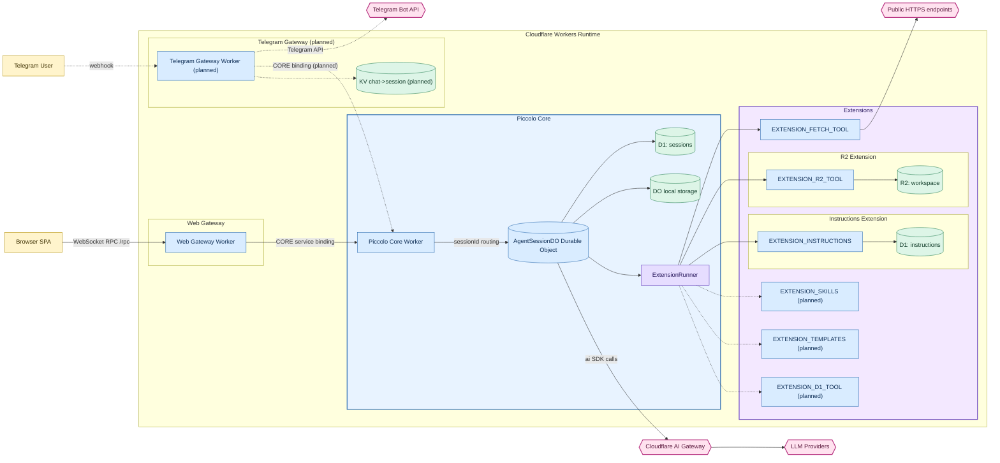

# Piccolo Architecture Diagram

This diagram reflects the current implementation plus planned components from the specification.

```mermaid
flowchart LR
  browser["Browser SPA"]
  telegram_user["Telegram User"]
  ai_gateway{{Cloudflare AI Gateway}}
  llm_providers{{LLM Providers}}
  public_web{{Public HTTPS endpoints}}
  telegram_api{{Telegram Bot API}}

  subgraph cloudflare["Cloudflare Workers Runtime"]
    subgraph web_group["Web Gateway"]
      web_gateway["Web Gateway Worker"]
    end

    subgraph core_group["Piccolo Core"]
      core_worker["Piccolo Core Worker"]
      session_do[("AgentSessionDO Durable Object")]
      extension_runner["ExtensionRunner"]
      d1_sessions[("D1: sessions")]
      do_storage[("DO local storage")]
    end

    subgraph ext_group["Extensions"]
      ext_fetch["EXTENSION_FETCH_TOOL"]
      subgraph r2_group["R2 Extension"]
        ext_r2["EXTENSION_R2_TOOL"]
        r2_workspace[("R2: workspace")]
      end
      subgraph instructions_group["Instructions Extension"]
        ext_instructions["EXTENSION_INSTRUCTIONS"]
        d1_instructions[("D1: instructions")]
      end
      ext_skills["EXTENSION_SKILLS (planned)"]
      ext_templates["EXTENSION_TEMPLATES (planned)"]
      ext_d1["EXTENSION_D1_TOOL (planned)"]
    end

    subgraph telegram_group["Telegram Gateway (planned)"]
      tg_gateway["Telegram Gateway Worker (planned)"]
      kv_telegram[("KV chat->session (planned)")]
    end
  end

  browser -->|"WebSocket RPC /rpc"| web_gateway
  web_gateway -->|"CORE service binding"| core_worker
  core_worker -->|"sessionId routing"| session_do
  session_do --> d1_sessions
  session_do --> do_storage
  session_do --> extension_runner
  session_do -->|"ai SDK calls"| ai_gateway
  ai_gateway --> llm_providers

  extension_runner --> ext_fetch
  extension_runner --> ext_r2
  extension_runner --> ext_instructions
  extension_runner -.-> ext_skills
  extension_runner -.-> ext_templates
  extension_runner -.-> ext_d1

  ext_fetch --> public_web
  ext_r2 --> r2_workspace
  ext_instructions --> d1_instructions

  telegram_user -.->|"webhook"| tg_gateway
  tg_gateway -.->|"Telegram API"| telegram_api
  tg_gateway -.->|"CORE binding (planned)"| core_worker
  tg_gateway -.-> kv_telegram

  classDef client fill:#fff4cc,stroke:#b38f00,color:#3d3000,stroke-width:1px;
  classDef worker fill:#d9ecff,stroke:#2b6cb0,color:#0f2f57,stroke-width:1px;
  classDef orchestrator fill:#e6ddff,stroke:#6b46c1,color:#2a1a5e,stroke-width:1px;
  classDef storage fill:#ddf5e7,stroke:#2f855a,color:#123d2a,stroke-width:1px;
  classDef external fill:#ffe2ef,stroke:#b83280,color:#5c1a3e,stroke-width:2px;

  class browser,telegram_user client;
  class web_gateway,core_worker,session_do,ext_fetch,ext_r2,ext_instructions,ext_skills,ext_templates,ext_d1,tg_gateway worker;
  class extension_runner orchestrator;
  class d1_sessions,do_storage,r2_workspace,d1_instructions,kv_telegram storage;
  class ai_gateway,llm_providers,public_web,telegram_api external;

  style core_group fill:#e8f3ff,stroke:#2b6cb0,stroke-width:2px,color:#0f2f57;
  style ext_group fill:#f3e8ff,stroke:#6b46c1,stroke-width:2px,color:#2a1a5e;
```
